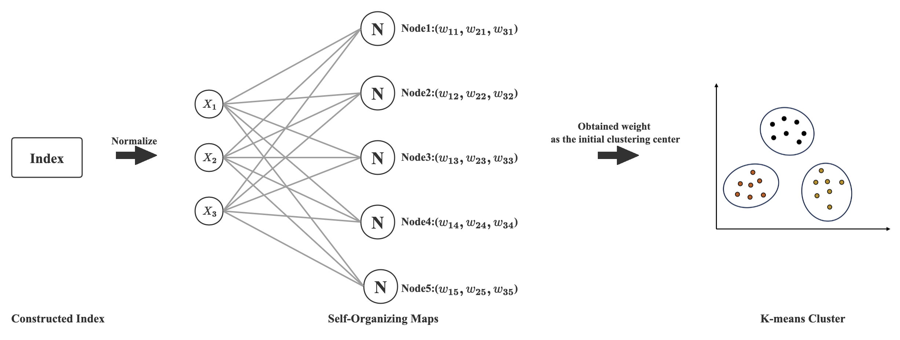

# Unsupervised Merge

A simple Python package to cluster one-dimention series, following my working paper.

## Installation

install the package using pip:

```
pip install usmerge
```

## SOM-K Cluster



The steps are over here.

- Implement the SOM algorithm. Enter the data to be clustered into the SOM network and train. Because only moderately accurate clustering results are needed, training time can be greatly reduced. Algorithm convergence is not necessary.

- After the training has concluded, the self-organization net- work makes each node in the output layer a nerve cell sen- sitive to a particular pattern. The inward star-like (Hu et al., 2002) weighting vector corresponding to each node becomes the center vector of each input pattern.

- Use the inward star-like weighting vector obtained in (2) as the initial clustering center and implement the K-means clustering algorithm.

- Obtain the SOM-K derived clusters and conduct relevant analysis.

# Usage
If you want to use som-k cluster.

```
from usmerge import som_k_merge

result = som_k_merge(data,3,sig=0.5,lr=0.5,echo=1000)

```

Of course, you could ignore the parameter(sig, lr, echo), I have initialized thiese parameters, but you could change if you want.


